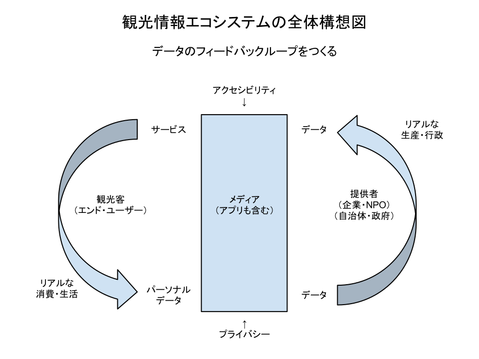

**オープンデータ**と**プライバシー**の両立がカギになります。データ提供者のインセンティブとして、ユーザーのパーソナルデータが還元される仕組み「データのフィードバックループ」を構想しています。

「データのフィードバックループ」のイメージ
----------------------------------

1. データ提供者（企業・NPO・自治体・政府）から提供されたデータは、メディアやアプリによって利用される。
2. メディアやアプリが、観光客（エンド・ユーザー）にサービスを提供する。ここでのポイントは**アクセシビリティ**と**ユーザビリティ**。
3. 観光客は、メディアやアプリが提供するサービスを、リアルな消費や生活のシーンで利用する。その結果として、パーソナルデータがメディアやアプリに取得される。
4. パーソナルデータが、メディアやアプリから、データ提供者に還元される。ここでのポイントは**プライバシー**。
5. データ提供者は、パーソナルデータを、リアルな生産や行政の活動に活かす。その活動から新たなデータが作られる。

本件にご関心をお持ちの方へ
----------------------

[Facebookグループ(tourinfo.jp)][c1]で観光ICTに関する情報交換や議論をしています。お気軽にご参加ください。あるいは発起人[石橋秀仁][c2]の[メール][c3]、[Facebook][c4]、[Twitter][c5]へお気軽にご連絡ください。

[c1]: https://www.facebook.com/groups/267182690120144/
[c2]: http://ja.ishibashihideto.net/
[c3]: mailto:hidetoi@gmail.com
[c4]: https://www.facebook.com/ishibashi.hideto
[c5]: https://twitter.com/zerobase
